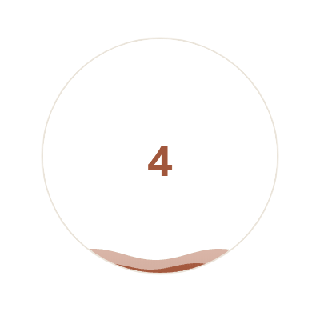

# flowing-liquid [](https://www.npmjs.com/package/flowing-liquid)

> A component for building flowing chart.

<p align="center">
  <a href="https://lbwa.github.io/flowing-liquid/">Online demo</a>
</p>

<p align="center">
  
</p>

## Installing

```bash
# yarn
yarn add flowing-liquid

# npm
npm i flowing-liquid --save
```

## Usage

**Notice**: Only `el` option is **required**.

```js
import FlowingLiquid from 'flowing-liquid'

const flowingLiquid = new FlowingLiquid({
  el: '#chart', // canvas element, required
  canvasWidth: 300, // canvas element width
  canvasHeight: 300, // canvas element height
  waterline: 60, // target waterline
  flowingBody: [
    {
      waveWidth: 0.055, // wave width
      waveHeight: 4, // wave height
      colors: ['#F39C6B', '#A0563B'], // a css color Array or css color String
      xOffset: 0, // start point offset, based on y-axis
      speed: 0.08 // flowing speed
    },
    {
      waveWidth: 0.04,
      waveHeight: 7,
      colors: ['rgba(243, 156, 107, 0.48)', 'rgba(160, 86, 59, 0.48)'],
      xOffset: 2,
      speed: 0.02
    }
  ],
  // indicator text, default value is parameter waterline
  font: {
    bold: true,
    color: '',
    size: 50,
    family: 'Microsoft Yahei',
    text: ''
  }
})

// 1st parameter means multiple waves spacing
// 2nd parameter means if canvas element show indicator text
flowingLiquid.render(5, true)
```
